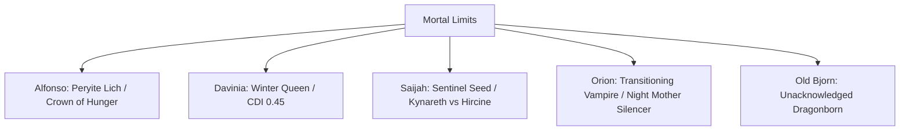

# SKYRIM CAMPAIGN CHRONICLE & STATUS UPDATE
**Campaign:** Torygg's Legacy
**Current Location:** Riften (Bee and Barb / Docks)
**Campaign Act:** Act III: The Mortal Limit
**System State Time:** Post-Riften (Session 15+ / Post-Chapter 21)

---

## I. CAMPAIGN ARCHITECTURE & PREMISE REFERENCE
In an alternate Skyrim, the Dragonborn (**Old Bjorn**, a charismatic fisherman-turned-cart-driver) never attended his execution at Helgen. Without the prophetic hero, the Dragon Cult is systematically resurrecting, the Daedric Cult of Mehrunes Dagon is fracturing the metaphysical anchors of Mundus, and the Thalmor are executing the **Tower Protocol** to dissolve the physical plane. 

To combat this, the late High King Torygg chartered the **Skyrim Wardens** (the players). However, the party has drifted far from traditional heroism, choosing monstrous Daedric transformations, necromancy, and plagues to survive the legendary difficulty. This has created a tragic mirror: **Krusp Fanck** and his **"True Wardens"** are operating as the clean-handed, beloved heroes of the realm, cleaning up the party's collateral damage while slowly marching toward their own mortal limits and tragic damnation.

---

## II. NARRATIVE PROGRESSION: THE CITY THAT DIDN'T NEED YOU
The party has just completed the Riften / Ratway Vaults chapter. The chronicle of this session (Chapters 20–21) covers the following key events:

### 1. The Disguise Check at the Rift Gate
Entering Riften required the party to mask their increasingly monstrous traits (Alfonso's rotting flesh, Orion's vampiric pale skin, Davinia's freezing aura). Through a series of Guile checks, they slipped past the gate guards, only to find the city walls plastered with notices thanking the *Obsidian Lanterns* (Krusp's moniker for the True Wardens) and Danica for saving the nearby Grove.

### 2. The Temple of Mara Confrontation
In the Temple of Mara, **Danica Pure-Spring** confronted **Davinia Caelus** in a six-point indictment. Danica exposed Davinia’s pathological need for control, her cold detachment, and her refusal to show genuine vulnerability. Danica has officially separated from the party's entourage. She has taken up residence at the Temple, using her light to heal the sick while actively protected by Krusp Fanck. 
*   **The Door Left Cracked:** Danica refused to seal the door forever, stating she will only return if Davinia undergoes genuine self-reckoning and relinquishes her absolute control (cracked to the width of a paw print).
*   **Alfonso's Unexpected Kindness:** Alfonso, despite his carrion-saint nature, provided Danica with clean healing herbs and resources, demonstrating a strange, lingering human empathy that contrasted sharply with Davinia’s icy detachment.

### 3. The Ratway Warrens & Vaults Descent
The party descended into the Ratway to locate Esbern:
*   **Orion's Secret Hunger:** Orion, struggling with Stage 3 Vampirism, stalked and fed upon an Argonian woman in the dark corners of the Warrens, killing her to hide his nature. 
*   **Mila's Rescue:** The party rescued/purchased **Mila**, an 8-year-old child, from her addict mother in the Warrens for 100 gold. Orion used his vampiric fangs to intimidate Mila into silence. While Mila is now safe on the cart, she is deeply traumatized and terrified of Orion, causing the rest of the party (especially Saijah and Bjorn) to maintain a highly protective guard around her.
*   **The Thalmor Clashes:** In the Ratway Vaults, the party intercepted a Thalmor extraction squad sent to assassinate Esbern. Utilizing Alfonso's plague thralls and Orion's shadow steps, they eliminated the Thalmor agents, recovering critical papers detailing the **Tower Protocol**.
*   **Esbern's Rescue:** The party successfully extracted **Esbern**, the paranoid, elder Dragon Cult expert. He is currently hiding in the secret compartment of the party's cart, safe but demanding they retrieve the Dragonstone from Bleak Falls Barrow to map the Dragon Cult's resurrection network.

---

## III. THE ACTIVE ROSTER: MECHANICS & APOTHEOSIS PROGRESSION

### 1. Davinia Caelus
*   **Archetype:** The Leader / The Winter Queen
*   **Mechanical Status:** Wizard Hand moves independently on a d10 ticker; mace engraved with Mara's symbol.
*   **Cold Detachment Index (CDI):** **0.45** (Approaching the 0.5 Point of Irreversibility).
*   **Current State:** Severed from Danica's emotional support. Davinia is leaning harder into tonal ice magic to suppress her grief. 
    *   *Ice Architecture Hand:* Her right hand has been completely replaced by Ismara's ice architecture.
    *   *Autonomic Breath Trade:* Sensed by Saijah, Davinia traded her autonomic breathing for the Blood-Fire frequency (every breath now takes conscious effort).
    *   *Atmoran Black Ice:* Her fire magic is permanently replaced by Atmoran black ice.
*   **Apotheosis Catalyst:** *The Crown of the Pale Lady / Ismara's Core*. She must decide whether to purge the ancient spirit Ismara (via Eldergleam roots) or fully merge with it.

### 2. Alfonso Duet
*   **Archetype:** The Undying / The Carrion Saint
*   **Mechanical Status:** Peryite Lich. His soul is housed in his rusting iron rapier (phylactery).
    *   *Physical Body:* Has NO hit points and cannot be reduced to them. Immune to conventional damage/poisons. Reknits near the intact rapier if destroyed.
    *   *Deep Rust:* **Stage 1 (3-4 segments)**. Rust spots are blooming on his skin. Pushed here by his triple-charge beam against Krosulhah.
    *   *Surface Rust:* Fuel for spell casting via Transmutation of Life. Reset each rest cycle.
*   **The Jagged Crown of Namira (The Crown of Hunger):** Fused the Nordic Jagged Crown (Akatosh/Stasis) with Namira's rot (Entropy/Consumption).
    *   *Curse of Satedness:* Alfonso can never feel sated (permanently Hungry psychologically, though can reach Satiated mechanically by feeding).
    *   *Devouring Command (3 FP):* Psychic wave forces enemies to frenzy and bite.
    *   *King's Feast (Passive):* Regenerates HP/FP when any creature is eaten on the battlefield.
    *   *Carrion King's Aura (Passive):* Frenzies also infect enemies with Alfonso's plague.
    *   *Final Feast (5 FP):* Liquefies a plagued creature to heal and raise a new Plague Ghoul.
    *   *Devouring the Voice (15 FP Reaction):* Nullifies and absorbs incoming Shouts (dragon's breath, Unrelenting Force).
    *   *Rotting Echo (Major Action):* Regurgitates corrupted parodies of devoured Shouts (Plague-Fire, Festering Rime, Wave of Decay).

### 3. Saijah
*   **Archetype:** The Hunter / The Sentinel Seed
*   **Mechanical Status:** Migraines returned upon entering the Rift (reacting to the dying root network).
*   **Active Assets:** Holds the returned *Hawk's Talon* and *Hawk's Feather*.
*   **Crossroads of the Wilds:** 
    *   *The Path of Kynareth:* Cleansing the Dagon corruption at the roots of the Throat of the World (requires a long, agonizing ritual but grants Avatar of the Green healing powers).
    *   *The Path of Hircine:* Embracing Alpha Lycanthropy to slaughter Dagon cultists efficiently (offered by Hircine as a white stag; Saijah hesitated, which Hircine noted).
*   **Current State:** Her Kynareth-attuned senses are muffled by dark stone. She is in a tense, territorial rivalry with the newly transformed werewolf, Ylva the Cleaver.

### 4. Orion
*   **Archetype:** The Double Agent / The Shadow
*   **Mechanical Status:** Transitioning Vampire — approaching the threshold of Vampire Lordling candidacy. Requires a specific ritual to complete the ascension but is already operating at the upper limit of non-Lord vampire power. Wields the *Diagnostic Song* (tonal mapping of physical/magical weaknesses).
*   **Current Contracts & Conflicts:**
    *   *Dark Brotherhood:* Holds the contract to assassinate Grelod the Kind (delivered by courier).
    *   *Valerius Caelus:* Ordered to enthrall Constance Michel in Riften to secure the Black-Briar child-thief pipeline.
    *   *Diagnostic Discovery:* Orion has detected tonal anomalies in Valerius's blood, identifying a critical blind spot: Valerius's Molag Bal stasis cannot tolerate Alfonso's Namira rot.

### 5. Old Bjorn
*   **Archetype:** The Carter / The War-Hound (Unacknowledged Dragonborn)
*   **Mechanical Status:** Possesses two dragon souls (Sahloknir, Krosulhah) and knows something is happening to him, though he does not yet have the framework for what he is. 
*   **Signs of Awakening:** His hair is turning dark, his reflexes are sharpening, and his physical health resembles a man in his thirties. 
*   **Narrative Burden:** He carries intense guilt over failing to save two young sisters (Lylana and Anya) forty years ago. He has projected this protective guilt onto Mila, swearing to kill anyone—including Orion—who threatens her safety.
*   **Dragonbone Shard:** Synchronized instantly with his dragon soul when Davinia gave it to him (he tucked it away without understanding why).
*   **Key Dialogue:** *"I stayed with you all because I believed you were better than the monsters I used to hunt. But if you let the darkness you carry spill over and catch her in the crossfire — I will pack the cart, take her, and leave. And I won't ever come back."*

---

## IV. TRAVELING ENTOURAGE & KEY RIFTEN NPCs

### The Entourage (The Cart Roster)
*   **Mila (8):** A rescued child. She sits in the cart bed, refusing to speak. She finds comfort near Saijah and Bjorn, but shivers and hides if Orion or Alfonso approach.
*   **Ylva the Cleaver:** A fierce Nord warrior transformed into a werewolf by Hircine. She is physically hyper-active, constantly pacing, and testing Saijah's authority.
*   **Esbern (~70):** Paranoid, brilliant, and smelling of damp straw. He refuses to leave the cart's false bottom until they depart Riften.
*   **Nora Ashvale:** Breton magic student. She is documenting Alfonso's *Transmutation of Life* and learning tonal theory from Orion, hoping to construct an artificial phylactery to store her deceased parents' souls.
*   **GEAR (Dwemer Automaton):** A bronze spider-construct housing a 4,000-year-old cognitive matrix. Incapable of grief. Noted Kyboh's tonal vector pointed to the Singing Glacier and observed "you could go there." Sits in Kyboh's empty seat on the cart without understanding why this is painful to others.
    *   *Tonal Log:* `[STATUS: LOGICAL GAVEL - CONSTRUCT KYBOH MISSING. ERROR: KINETIC MULTIPLIER DETECTED IN SINGING GLACIER. RECOMMENDATION: SALVAGE OR TERMINATE SHADOW-UNIT.]`

### Key Riften Figures
*   **Danica Pure-Spring:** Working tirelessly at the Temple of Mara. She wears a chainmail hauberk over her priestess robes now, her hands calloused from wielding Kynareth's light as a weapon.
*   **Krusp Fanck:** The Ashen Blade. He stands guard outside the Temple of Mara, watching the party with cold disappointment. He is armed with his legendary sword, *Dawnbringer*, standing ready to protect Danica.
*   **Maven Black-Briar:** Furious about the sabotage of her meadery vats. She has offered the party 5,000 gold to identify the poisoners, unaware that Alfonso's plague is the source of the contamination.
*   **Grelod the Kind:** The head of Honorhall Orphanage. Publicly, she is celebrated as a saintly philanthropist who houses the city's street urchins. Privately, she beats the children, starves them, and sells the compliant ones to Maven Black-Briar's smuggling rings. *(The party must witness this duality before leaving the hold).*

---

## V. THE TRIAD OF CONSEQUENCE: GATE 3 MATRIX
The party sits in the Bee and Barb. The following three crises are active. Choosing one means Krusp's True Wardens will handle the second (suffering severe attrition), while the third is ignored, advancing the Apocalypse Clocks.

| Crisis (Fire) | Party Path (Monstrous/Pragmatic) | Krusp's Path (The Price of Honor) | Ignored Path (Apocalypse Effect) |
| :--- | :--- | :--- | :--- |
| **🔥 Fire A: Windhelm Barricades** | **The Urban Intrigue:** Alfonso hijacks his own plague to raise a Stormcloak thrall-army. He seeks the Conclave scripture. Orion executes the Hroki contract. | **The Purge:** Krusp and Danica quarantine the city and purge the cultists with holy fire. **Attrition:** Danica contracts the necrotic rot; her lungs are permanently scarred. | **The Plague Spread:** The Stormcloak army collapses. Windhelm is quarantined. The Dragon Cult claims 5,000 fresh corpses for their army. The Empire takes Eastmarch. |
| **🔥 Fire B: The Bleeding Stair** | **The Cosmic Ascent:** Saijah climbs the 7,000 Steps, confronting Gaelen the Root-Twister (his introduction). Saijah makes her choice between Kynareth and Hircine. | **The Shield of Stendarr:** Krusp leads a squad to protect the waystones. **Attrition:** One of his close hirelings is caught in a time-stutter trap and aged to dust. | **The Time Crack:** The Dagon Clock advances. The 7,000 Steps fracture into non-linear spatial loops. Reaching High Hrothgar now requires navigating random portals to the Deadlands. |
| **🔥 Fire C: The Dragonstone** | **The Espionage:** The party runs a silent infiltration of Bleak Falls Barrow against a Thalmor blockade. Alfonso uncovers clues leading to Antoine's lab in Forelhost. | **The Recovery:** Krusp and his companions secure the Dragonstone for Esbern. **Attrition:** A young local guide helping them is captured and executed by the cult. | **Permanent Reactivity:** The Dragonstone is lost to a Dragon Cult retrieval. Alduin's Wall and Sky Haven Temple stay closed; the main-quest spine stalls and the party remains flat-footed. |

---

## VI. ACTIVE WORLD CLOCKS

### 1. The Dragon Cult Apocalypse Clock (Tier 1: Destabilization)
*   *Active Operations:* Nahkriin's agents are conducting false-flag operations, framing Imperial and Stormcloak squads to prevent peace talks.
*   *Alchemical Progress:* Antoine of Forelhost is refining Alfonso's plague into Strain 2.0 inside his secure incubation lab at Forelhost (in the Rift).
*   *World Impact:* General merchant prices are inflated by **+50%**; food prices are inflated by **+75%** due to disrupted caravans.

### 2. The Dagon Cult Unmaking Clock (Tier 0: The Sowing)
*   *Active Operations:* The Eldergleam Sanctuary is bleeding dark oil, killing the root network of the Throat of the World.
*   *World Impact:* The pine forests of Falkreath and Eastmarch are turning ash-gray. Wild beasts are spawning with extra eyes and fiery hides.

### 3. The Civil War Clock (Phase 1: First Blood)
*   *Active Operations:* General Tullius and Ulfric Stormcloak have initiated active troop movements.
*   *Status:* The Stormcloak vanguard is paralyzed near Windhelm due to the plague. The Imperial Legion is preparing a massive push from Solitude.

---

## VII. THALMOR INTELLIGENCE: THE TOWER PROTOCOL
Recovered from the Thalmor extraction squad in the Ratway Vaults, this document details the Altmeri Dominion's endgame:
1.  **The Snow-Throat Unbinding:** The Thalmor believe that the physical plane is an artificial cage. By letting the Dagon Cult rot the roots of the Throat of the World (Snow-Throat) and destroying the structural pillars of Skyrim, they will deactivate the local "Tower."
2.  **The Great Dissolution:** Once all Towers (including Crystal-Like-Law and Snow-Throat) are deactivated, the mortal plane will dissolve, returning the Altmer to their ancestral, immortal spirit forms while erasing the races of Man.
3.  **Active Target List:** The party, Krusp Fanck, and Esbern are marked for immediate execution. Warrants are active in all Imperial-aligned holds.
    *   *Mechanical Rule:* Entering an Imperial-aligned hold (Solitude, Whiterun, Markarth) requires monstrous party members to pass a **Guile check (TN 14)** or trigger an immediate Thalmor ambush.

---

## VIII. GM ACTIONS & RUNNING THE CRUCIBLE
To maintain the campaign's dark, emergent, and highly challenging tone:
1.  **Do Not Plan Solutions:** Provide the players with highly volatile catalysts (like the Aetherial Matrix, the Eldergleam Sap, or Valerius's blood) and let them design their own god-killing power-ups.
2.  **Enforce the Triad of Consequence:** The moment the players select their destination from the Riften Board, immediately document Krusp's parallel victory (and attrition) and apply the devastating world effects of the ignored third fire.
3.  **Keep the Razor Close:** Ensure the Mythic Dawn commentaries and Silus Vesuius's quest are active in the background, keeping the **False Dragonborn** soul-carving ritual available as an easy, tragic shortcut when the pressure becomes unbearable.

---

## IX. REGIONAL WORLD STATE TRACKER (PRESENT REALITY)

### 1. Active Faction Operations & Micro-Consequences
*   **The Black-Briar Meadery Sabotage:** Maven Black-Briar has discovered her meadery vats have been compromised by a toxic plague strain (unknowingly introduced by Alfonso). She has paid Danica Pure-Spring 10,000 gold bounty for the defense of the Grove, and is offering a 5,000 gold contract to the Wardens to investigate the contamination.
*   **Hemming Black-Briar (SURVIVED):** Due to the party's late arrival in Riften (choosing the Aetherial Matrix over immediate duty), Hemming was almost killed in the initial chaos of the Riften infiltration. Danica Pure-Spring saved his life, which is why Maven owes Danica everything and paid her the 10,000 gold bounty. Maven is cold and transactional toward the party because they failed to act in time, and the glory belongs to Danica and Krusp.
*   **The Thalmor Hunt Protocol:** The Thalmor "Persons of Interest" manhunt is actively prioritizing the party and Krusp. The party must maintain active disguises or avoid Imperial patrols entirely.

### 2. Character-Specific World Interactions
*   **Alfonso (Peryite Lich / Crown of Hunger):**
    *   Alfonso is adapting to his new existence as a Peryite Lich, with his soul anchored in his rusting rapier. He does not suffer from vampirism or need to feed on blood.
    *   His custom pathogen has successfully infected Mila's mother, rendering her an active carrier.
    *   His actions have permanently aligned him with Namira's coven, drawing the ire of Valerius Caelus.
*   **Orion's Secret Sins & Double Agency:**
    *   Orion murdered an Argonian civilian in the Warrens to feed and cover his stage 3 vampirism.
    *   Mila remains deeply traumatized and terrified of Orion due to his intimidation check with his fangs.
    *   Orion is tracking Grelod the Kind for the Dark Brotherhood, while Valerius expects him to enthrall Constance Michel.
*   **Davinia's Broken Ties:**
    *   Davinia's relationship with Danica Pure-Spring has collapsed. Danica has hardened, joined Krusp, and actively guards herself against Davinia's attempts at manipulation.
    *   The Empire soldiers at the Solitude Gate previously recognized Davinia, leaving her father's (General Caelinus) network alerted to her movements.
*   **The Morthal Consequence:**
    *   The party failed to save the townsfolk of Morthal in the past. Instead, they convinced Valerius Caelus to feed elsewhere, leaving Morthal scarred, paranoid, and hostile to outsiders.
    *   Valerius is actively moving toward Solitude to establish his court following the events of "Echoes of a Fallen King."
*   **Road Crimes:**
    *   The party killed civilian Imperial tax collectors on the road. Valerius possesses the dossier on this crime and holds it as active blackmail against Orion and the group.
*   **Saijah's Trophies:**
    *   Saijah holds both Hawk Tokens, signaling her tactical supremacy and connection to the wild.
*   **Kyboh (DECEASED / Hjolmar-Stolen):**
    *   Kyboh is dead. His body is hijacked by Hjolmar-Kyboh. His soul-signature copy is bound to Ulag as the Echo Mimic. The party does not know this yet and believes he can be rescued in the Singing Glacier.

### 3. Current Immediate Action Steps for the GM
1.  **Orphanage Scene:** The party must witness Grelod the Kind's public adoration by Riften's citizens contrasted with her private abuse of the children at Honorhall Orphanage before they can travel out of the hold.
2.  **Krusp's Watch:** Krusp Fanck is actively shadowing the party in Riften, ensuring they do not exploit Danica or cause further damage to the citizens.
